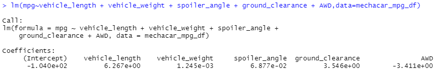
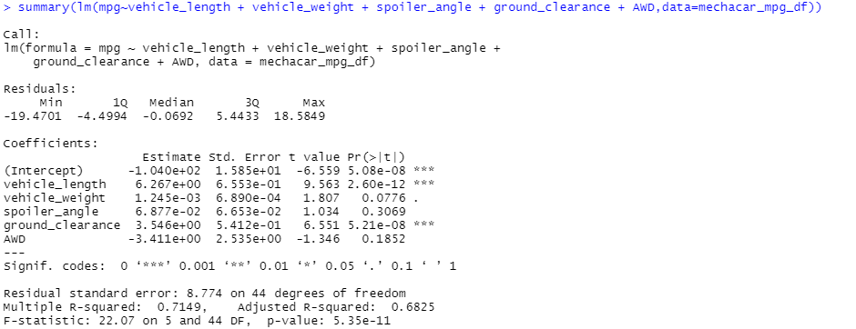
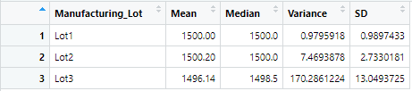
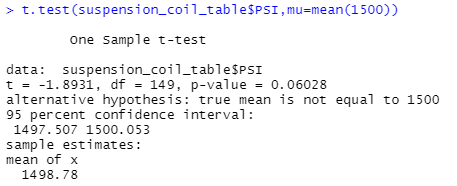
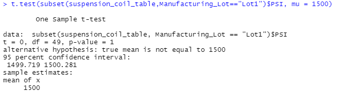
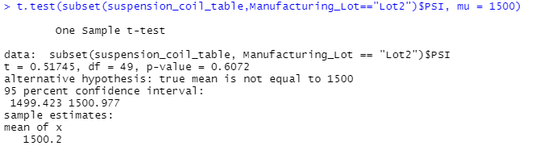
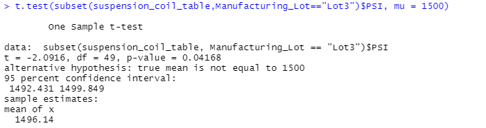

# **MechaCar_Statistical_Analysis**

## **Linear Regression to Predict MPG**

1.) Which variables/coefficients provided a non-random amount of variance fo the mpg values in the dataset?

- vehicle_weight: 0.0776
- spoiler_angle: 0.3069
- AWD: 0.1852
	
2.) Is the slope of the linear model considered to be zero? Why or why not?

The p-value of 5.35 x 10^-6 equals to less than 0.05 and therefore the slope of the linear model is not considered equal to zero.

3.) Does this linear model predict mpg of the MechaCar prototypes effectively? Why or why not?

The r-squared value is 0.7149 which translates to 71%; therefore, the linear model does predict the mpg of MechaCare prototypes effectivley.

## **Summary Statistics on Suspension Coils**

Total_Summary

- The PSI Mean for all 3 lots is 1498.78
- The PSI Median for all 3 lots is 1500
- The PSI Variance for all 3 lots is 62.29
- The PSI standard deviation for all 3 lots is 7.892

Looking at the total_summary_df, the variance for all 3 lots is 62.29. The lot_summary_df shows the standard deviation for Lot 1 is 0.989, Lot 2 is 2.733, and Lot 3 is 13.049. 

The variance for the suspension coils does not exceed 100 pounds per square inch. Therefore, the manufacturing data does meet the design specification for all the manufacturing lots. 

## **T-Tests on Suspension Coils**

The p-value for all three lots is 0.06 which is less than 0.05. We can infer the PSI across all manufacturing lots is not statistically different from the population mean of 1500 pounds per square inch. The null hypothesis would not be rejected. 

The p-value for lot 1 is 1. This is more than the 0.05. This is not statistically different to reject the null hypothesis.

The p-value for lot 2 is 0.06 which is more than 0.05. This is not statistically different to reject the null hypothesis.

The p-value for lot 3 is 0.04 which is less than 0.05. The null hypothesis will be rejected. The true mean does not equal 1500.

## **Study Design: MechaCar vs Competition**

A one-way ANOVA test is one way MechaCar can see how it performs against it's competitors. This will allow for testing of different metrics by vehicle class (e.g., cost, city or highway fuel efficiency, horse power, maintenance cost, or safety rating). 

MechaCar can compare its suv's highway fuel efficieny against it's competitors. The suv's will be independent variable since this is the categorical data and the dependent variable will be highay fuel efficieny since this is numerical and continous. The null hypotheses would indicate, if MechaCar's highfuel efficiency p-value is below 0.05 then it is different from it's competitors.
The alternate hypotheses would indiciate, if the p-value was above 0.05, then it would be the same.

Once the p-value has been determined, then we would need to get the mean to determine if MechaCar falls above or below. MechaCar can then have a more accurate picture of where they stand against their competitors. 

In order to run an ANOVA test, we would need to get the different vehicle class types of MechaCar and the competitors and the highway fuel efficiency data for each as well.  

